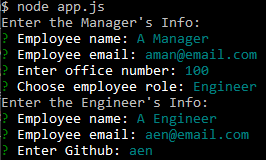
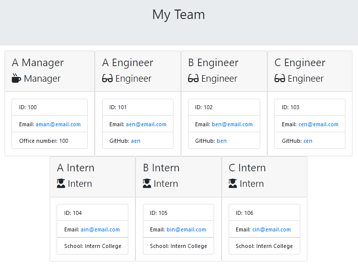

# HTML_Team_Generator
This `node` command-line application generates an HTML file that contains key pieces of information about members of a software engineering team. The [`inquirer`](https://www.npmjs.com/package/inquirer) module is used to prompt the user for the information of each team member; this information is then used to generate a nicely formatted team roster webpage.

This project uses the ES6 `class` mechanism to organize and store the team members' information. 
The [`email-valitator`](https://www.npmjs.com/package/email-validator) module is used to validate email addresses entered by the user.

## Usage
Run the application by typing `node app.js`.
You'll be prompted for information on the various members of a software team. You'll first be prompted for information about the Manager: *name*, *email*, *office number*. Afterwards, you can enter information for as many Engineers or Interns as you choose. For Engineers you'll be prompted for *name*, *email*, and *github name*; while for Interns you'll be prompted for *name*, *email*, and *school*. (Each employee also has an *id* number which is assigned automatically by the application.)

All of the user's inputs are validated.
* Names can only contain letters and spaces
* Email addresses must have the expected format. Email validation is done using the `email-validator` module.
* The Office Number must be an integer.
* Github names can contain letters, numbers, and single dashes. It also must not begin or end with a dash.
* School names must contain only letters and spaces.  

After all the information has been collected, an html file with a visual depicition of the information is generated at `output/team.html`. A sample of the program's output is shown below.

A video of the app in action can be viewed [here](https://drive.google.com/file/d/1EHx9h0F-zsu23D_ofAUO4s18G4HtNz5n/view?usp=sharing).

## Class Hierarchy
As mentioned in the intro, ES6 classes are used for collecting and storing information on the various employees. There are classes corresponding to the Manager, Engineer, and Intern. These three classes each inhert from the Employee base class. 

The Employee class contains *name*, *id*, *email*, and *role* properties, as well as related accessor methods i.e. `getName()`, `getId()`, `getEmail()`, and `getRole()`. The *role* has a default value of `Employee`.

The Manager class inherts from the Employee class. It adds it's own property *office number* and related accessor `getOfficeNumber()`. It also overrides the *role* property to have a value of `Manager`. 

Similarly, the Engineer class inherits from Employee and adds the property *github* and accessor `getGithub()`. The *role* property is overridden to be `Engineer`. 

The Intern inherits from Employee; adds the property *school* and accessor `getSchool()`. The *role* is overriden to be `Intern`. 

